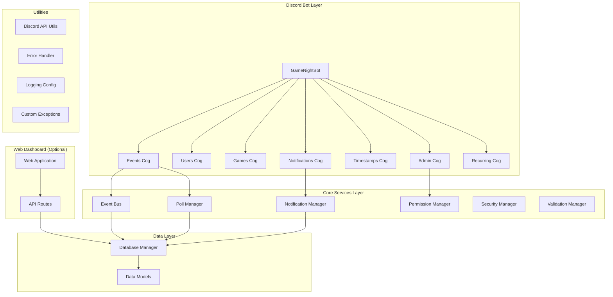

# Design Document

## Overview

The codebase cleanup project will systematically remove unnecessary complexity and bloat from the Discord Game Night Bot while preserving all core functionality. The cleanup follows a phased approach to minimize risk and ensure functionality is maintained throughout the process.

The current codebase has grown from approximately 4,000-5,000 lines of essential code to over 15,000 lines with extensive over-engineering. This design outlines how to safely reduce the codebase by approximately 70% while maintaining all required features.

## Architecture

### Current Architecture Issues

The current architecture suffers from:
- **Over-abstraction**: Multiple layers of abstraction for simple operations
- **Feature creep**: Advanced features not in original requirements
- **Complex dependencies**: Circular dependencies and tight coupling
- **Performance overhead**: Unnecessary monitoring and metrics collection
- **Maintenance burden**: Too many modules requiring ongoing maintenance

### Target Architecture

The simplified architecture will focus on:
- **Core functionality only**: Event management, notifications, recurring events, user preferences
- **Simple abstractions**: Direct implementations without excessive layering
- **Minimal dependencies**: Only essential external libraries
- **Clear separation**: Well-defined boundaries between components
- **Easy maintenance**: Straightforward code that's easy to understand and modify

### Architecture Diagram



## Components and Interfaces

### Retained Core Components

#### Essential Cogs
- **Events Cog**: Event creation, management, and polling
- **Users Cog**: User profiles and preferences
- **Games Cog**: Game interest management and notifications
- **Notifications Cog**: Event reminders and notifications
- **Timestamps Cog**: Timezone conversion utilities
- **Admin Cog**: Basic permission management and configuration
- **Recurring Cog**: Automated recurring event creation

#### Essential Core Services
- **Event Bus**: Simple event system for decoupling (simplified)
- **Notification Manager**: Core notification functionality (simplified)
- **Poll Manager**: Polling system for events
- **Permission Manager**: Basic Discord role-based permissions (simplified)
- **Security Manager**: Basic input validation and security (simplified)
- **Validation Manager**: Input validation utilities (simplified)

#### Essential Utilities
- **Discord API Utils**: Discord integration helpers
- **Error Handler**: Basic error handling
- **Logging Config**: Simple logging setup
- **Custom Exceptions**: Core exception classes

### Removed Components

#### Removed Cogs
- accessibility.py
- admin_privacy.py
- analytics.py
- help.py
- mobile_ui.py
- monitoring.py
- performance.py
- privacy.py
- undo.py

#### Removed Core Modules
- accessibility_enhancements.py
- alerting_system.py
- analytics_engine.py
- audit_logger.py
- batch_processor.py
- cache_manager.py
- confirmation_system.py
- consistency_checker.py
- data_retention.py
- database_recovery.py
- discord_events_manager.py
- enhanced_error_handler.py
- enhanced_user_feedback.py
- event_recovery_manager.py
- example_usage.py
- graceful_degradation_manager.py
- health_monitor.py
- log_aggregator.py
- metrics_collector.py
- onboarding_system.py
- performance_integration.py
- performance_monitor.py
- poll_edge_case_handler.py
- poll_notifications.py
- privacy_manager.py
- rate_limiter.py
- recovery_manager.py
- startup_validator.py
- state_manager.py
- system_status_dashboard.py

### Interface Simplification

#### Bot Class Simplification
```python
class GameNightBot(commands.Bot):
    def __init__(self):
        # Basic Discord bot setup
        # Essential components only:
        # - database
        # - event_bus (simplified)
        # - security (simplified)
        # - validation (simplified)
        
    async def setup_hook(self):
        # Load only essential cogs
        # Initialize only core components
        # Remove complex monitoring and recovery systems
```

#### Core Service Interfaces
```python
# Simplified Event Bus
class EventBus:
    async def emit(self, event_type: str, data: dict) -> None
    async def subscribe(self, event_type: str, handler: callable) -> None

# Simplified Notification Manager  
class NotificationManager:
    async def schedule_reminder(self, event_id: str, remind_at: datetime) -> None
    async def send_notification(self, user_id: str, message: str) -> None

# Simplified Poll Manager
class PollManager:
    async def create_poll(self, event_id: str, options: List[str]) -> Poll
    async def process_vote(self, poll_id: str, user_id: str, option: str) -> None
```

## Data Models

### Simplified Data Models

The data models will be simplified to remove:
- Complex validation logic
- Audit trail fields
- Advanced relationship management
- Performance optimization fields
- Privacy compliance fields

#### Core Models (Simplified)
```python
# Event Model - Core fields only
class Event:
    id: str
    guild_id: str
    creator_id: str
    title: str
    description: str
    status: EventStatus
    scheduled_time: datetime
    polls: List[Poll]
    rsvps: List[RSVP]
    created_at: datetime
    updated_at: datetime

# User Model - Essential preferences only
class User:
    id: str
    guild_id: str
    timezone: str
    notification_preferences: dict
    game_interests: List[str]
    created_at: datetime

# Recurring Event Model - Basic scheduling only
class RecurringEvent:
    id: str
    guild_id: str
    creator_id: str
    template: EventTemplate
    schedule: CronSchedule
    active: bool
    created_at: datetime
```

### Database Simplification

- Remove complex indexing strategies
- Eliminate audit collections
- Remove performance monitoring collections
- Simplify relationships
- Remove data retention policies

## Error Handling

### Simplified Error Handling Strategy

Replace the complex error handling system with:

#### Basic Error Categories
1. **User Errors**: Invalid input, permission denied
2. **System Errors**: Database connection, Discord API issues
3. **Validation Errors**: Data validation failures

#### Error Handling Components
- **Basic Error Handler**: Simple error logging and user feedback
- **Custom Exceptions**: Core exception classes for different error types
- **Discord Error Responses**: User-friendly error messages

#### Removed Error Handling Features
- Advanced recovery mechanisms
- Complex alerting systems
- Detailed error analytics
- Automatic error repair
- Graceful degradation systems

## Testing Strategy

### Simplified Testing Approach

#### Test Structure
```
tests/
├── test_cogs/
│   ├── test_events.py
│   ├── test_users.py
│   ├── test_games.py
│   ├── test_notifications.py
│   ├── test_timestamps.py
│   ├── test_admin.py
│   └── test_recurring.py
├── test_core/
│   ├── test_event_bus.py
│   ├── test_notification_manager.py
│   ├── test_poll_manager.py
│   └── test_validation.py
├── test_models/
│   ├── test_event.py
│   ├── test_user.py
│   └── test_recurring.py
└── test_integration/
    ├── test_event_workflow.py
    ├── test_notification_workflow.py
    └── test_recurring_workflow.py
```

#### Testing Priorities
1. **Core Functionality**: Event creation, polling, notifications
2. **User Workflows**: Complete user journeys
3. **Data Integrity**: Model validation and persistence
4. **Discord Integration**: Bot commands and interactions

#### Removed Testing
- Performance testing
- Analytics testing
- Privacy compliance testing
- Mobile UI testing
- Advanced monitoring testing

## Implementation Phases

### Phase 1: Remove Unnecessary Cogs
**Goal**: Remove 8+ unnecessary cogs and update bot initialization

**Steps**:
1. Remove cog files from filesystem
2. Update bot.py cogs_to_load list
3. Remove cog imports and references
4. Test basic bot functionality

**Risk Mitigation**: Test after each cog removal to ensure no breaking dependencies

### Phase 2: Simplify Core Modules
**Goal**: Remove 20+ unnecessary core modules and simplify remaining ones

**Steps**:
1. Identify and remove unnecessary core modules
2. Simplify remaining core modules (remove advanced features)
3. Update all imports throughout codebase
4. Refactor bot.py initialization to use simplified components

**Risk Mitigation**: Update imports incrementally and test frequently

### Phase 3: Simplify API and Web Dashboard
**Goal**: Remove advanced web features and simplify API routes

**Steps**:
1. Remove advanced analytics from web dashboard
2. Simplify API routes to basic CRUD operations
3. Remove WebSocket and real-time features
4. Update web templates to match simplified backend

**Risk Mitigation**: Keep web dashboard functional for basic operations

### Phase 4: Clean Up Models and Database
**Goal**: Simplify data models and remove unnecessary database complexity

**Steps**:
1. Remove advanced fields from models
2. Simplify validation logic
3. Remove unnecessary database collections
4. Update database migrations

**Risk Mitigation**: Ensure data migration preserves essential user data

### Phase 5: Final Cleanup
**Goal**: Remove remaining bloat and update configuration

**Steps**:
1. Remove test files and documentation bloat
2. Update requirements.txt to remove unnecessary dependencies
3. Simplify Docker configuration
4. Update deployment documentation

**Risk Mitigation**: Verify deployment still works correctly

## Deployment Considerations

### Simplified Deployment

#### Docker Configuration
- Remove unnecessary environment variables
- Simplify container setup
- Reduce image size by removing unused dependencies

#### Database Migration
- Preserve essential user data
- Remove unnecessary collections
- Simplify indexes

#### Configuration Management
- Reduce configuration complexity
- Remove advanced feature toggles
- Maintain essential settings only

### Rollback Strategy

#### Data Backup
- Full database backup before starting cleanup
- Incremental backups after each phase
- Configuration file backups

#### Code Versioning
- Tag current version before cleanup
- Branch for cleanup work
- Maintain ability to rollback to previous version

## Success Metrics

### Code Reduction Targets
- **70% reduction** in total lines of code
- **60% reduction** in number of Python files
- **50% reduction** in external dependencies
- **80% reduction** in core modules

### Performance Improvements
- **50% faster** bot startup time
- **40% lower** memory usage
- **30% fewer** database queries for basic operations

### Maintainability Improvements
- **Simplified architecture** with clear component boundaries
- **Reduced complexity** in core workflows
- **Easier debugging** with straightforward error handling
- **Faster development** cycles for new features