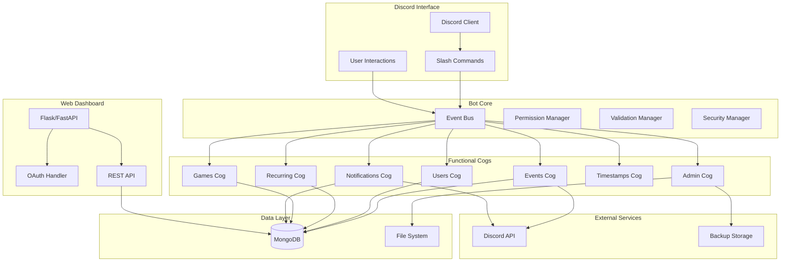

# Design Document

## Overview

The Discord Game Night Scheduling Bot is a comprehensive event management system built with Python using py-cord and MongoDB for data persistence. The system follows a microservice-inspired architecture with distinct cogs handling different functional areas, unified by an event bus system for inter-component communication.

The bot operates as both a Discord application and a web service, providing dual interfaces for user interaction and administrative management. The design emphasizes reliability, scalability, and user experience while maintaining the social aspects of community gaming.

## Architecture

### High-Level Architecture



### Component Responsibilities

**Event Bus**: Central communication hub that enables loose coupling between cogs. Handles event propagation for state changes, user actions, and system events.

**Permission Manager**: Centralized authorization system that maps Discord roles to bot permissions and handles resource-specific access control.

**Validation Manager**: Input sanitization and validation system that ensures data integrity and prevents malicious input.

**Security Manager**: Handles authentication, session management, and security policies across both Discord and web interfaces.

## Components and Interfaces

### Core Bot Framework

**Bot Class Structure**:
```python
class GameNightBot(commands.Bot):
    def __init__(self):
        self.database = DatabaseManager()
        self.event_bus = EventBus()
        self.security = SecurityManager()
        self.metrics = MetricsCollector()
        self.health_monitor = HealthMonitor()
    
    async def setup_hook(self):
        # Load all cogs
        # Initialize database connections
        # Start background tasks
        # Register health checks
```

**Event Bus System**:
```python
class EventBus:
    async def emit(self, event_type: str, data: dict):
        # Broadcast events to registered listeners
    
    def register(self, event_type: str, callback: callable):
        # Register event handlers
```

### Events Cog Design

**Core Event Management**:
- Event lifecycle management (DRAFT → DATE_POLLING → TIME_POLLING → GAME_POLLING → SCHEDULED → COMPLETED)
- Poll creation and management with configurable timeouts
- Discord scheduled event integration with bidirectional sync
- Automatic state transitions based on poll results and timeouts

**Event Data Model**:
```python
{
    "_id": "ObjectId",
    "guild_id": "str",
    "discord_event_id": "str|null",
    "title": "str",
    "description": "str", 
    "creator_id": "str",
    "state": "enum",
    "schedule": {
        "selected_date": "date|null",
        "selected_time": "time|null",
        "timezone": "str",
        "duration_minutes": "int|null"
    },
    "polls": {
        "date_poll": {...},
        "time_poll": {...},
        "game_poll": {...}
    },
    "rsvp_data": {...},
    "attendance": {...}
}
```

**Poll Management System**:
- Button-based voting interface for dates and times
- Multi-select dropdown for game selection
- Real-time vote counting with conflict resolution
- Automatic poll advancement with admin override capabilities
- Tie-breaking mechanisms (admin choice, runoff polls)

### Users Cog Design

**User Profile Management**:
- Timezone preference storage and automatic conversion
- Availability scheduling (weekly recurring patterns)
- Notification preferences (channels, timing, frequency)
- Game interest registration with fuzzy matching
- Attendance history and statistics tracking

**User Data Model**:
```python
{
    "user_id": "str",
    "guild_id": "str",
    "profile": {
        "timezone": "str",
        "availability": {...},
        "notification_preferences": {...}
    },
    "game_interests": ["str"],
    "attendance_history": [...],
    "statistics": {...}
}
```

### Recurring Events Cog Design

**Schedule Management**:
- Cron-like scheduling with monthly/weekly patterns
- Template-based event generation with variable substitution
- Automatic poll triggering based on configured schedules
- Schedule pause/resume functionality
- Execution history and error tracking

**Recurring Schedule Model**:
```python
{
    "guild_id": "str",
    "name": "str",
    "schedule": {
        "trigger_type": "enum[MONTHLY, WEEKLY]",
        "trigger_day": "int",
        "trigger_time": "time",
        "timezone": "str"
    },
    "template": {
        "title_template": "str",
        "description_template": "str",
        "default_games": ["str"]
    },
    "status": {
        "is_active": "bool",
        "next_trigger": "datetime"
    }
}
```

### Games Cog Design

**Game Interest System**:
- Fuzzy matching for game name resolution
- Interest registration with notification preferences
- Ping system for spontaneous gaming sessions
- Game popularity tracking and analytics
- Alias management for common game name variations

**Game Notification Flow**:
1. User runs `/gn games ping "Game Name"`
2. System performs fuzzy matching against registered games
3. If no exact match, presents suggestions with confirmation buttons
4. On confirmation, mentions all interested users
5. Records notification for analytics and frequency limiting

### Notifications Cog Design

**Notification Engine**:
- Database-backed notification scheduling system
- Multiple delivery channels (DM, server channels)
- Retry logic with exponential backoff
- User preference filtering and timezone conversion
- Batch processing for efficiency

**Notification Types**:
- Event reminders (configurable timing)
- Poll closing warnings
- Game ping notifications
- Admin alerts and system notifications
- Recurring event announcements

### Web Dashboard Design

**Authentication Flow**:
1. Discord OAuth2 integration with guild scope verification
2. JWT session management with configurable expiration
3. Permission verification based on Discord roles
4. CSRF protection and security headers

**Dashboard Features**:
- Real-time event calendar with interactive controls
- User management interface with bulk operations
- Analytics dashboard with charts and exportable reports
- Configuration management with validation and preview
- System monitoring with health checks and logs

**API Design**:
```
GET    /api/events                 - List events with pagination
POST   /api/events                 - Create new event
GET    /api/events/{id}            - Get event details
PUT    /api/events/{id}            - Update event
DELETE /api/events/{id}            - Cancel event

GET    /api/users                  - List users with filters
PUT    /api/users/{id}/preferences - Update user preferences

GET    /api/analytics/attendance   - Attendance statistics
GET    /api/analytics/games        - Game popularity data
```

## Data Models

### Database Schema Design

**Collections Structure**:
- `events` - Core event data with embedded polls and RSVP information
- `users` - User profiles with preferences and statistics
- `recurring_schedules` - Recurring event configurations
- `game_interests` - User game interest mappings
- `notifications` - Notification queue and history
- `guild_configs` - Server-specific configuration
- `audit_logs` - System action logging

**Indexing Strategy**:
```python
INDEXES = {
    "events": [
        {"guild_id": 1, "state": 1, "created_at": -1},
        {"guild_id": 1, "discord_event_id": 1},
        {"guild_id": 1, "schedule.selected_date": 1}
    ],
    "users": [
        {"user_id": 1, "guild_id": 1},
        {"guild_id": 1, "game_interests": 1}
    ],
    "notifications": [
        {"scheduled_for": 1, "processed": 1}
    ]
}
```

### Data Relationships

**Event → User Relationships**:
- Creator relationship (one-to-one)
- RSVP relationships (many-to-many)
- Attendance tracking (many-to-many)
- Poll voting relationships (many-to-many)

**User → Game Relationships**:
- Interest registration (many-to-many)
- Notification history (one-to-many)
- Play frequency tracking (aggregated data)

## Error Handling

### Failure Scenarios and Recovery

**Discord API Failures**:
- Rate limit handling with queue management
- Retry logic with exponential backoff
- Graceful degradation when Discord is unavailable
- Admin notifications for persistent failures

**Database Connectivity Issues**:
- Connection pooling with automatic reconnection
- Operation queuing during outages
- Data consistency checks on reconnection
- Backup and restore procedures

**Event Creation Failures**:
- State preservation for manual intervention
- Rollback mechanisms for partial failures
- Admin notification system
- Recovery workflows for common failure modes

**Poll Management Edge Cases**:
- Tie vote resolution mechanisms
- No-vote scenarios with admin escalation
- User departure during active polls
- Poll timeout handling with automatic advancement

### Input Validation and Security

**Validation Framework**:
```python
VALIDATION_RULES = {
    'event_title': {
        'max_length': 100,
        'min_length': 3,
        'forbidden_patterns': [r'@everyone', r'@here'],
        'forbidden_chars': ['`', '\n', '\r']
    },
    'timezone': {
        'validate_timezone': True,
        'fallback': 'UTC'
    }
}
```

**Security Measures**:
- Input sanitization for all user-provided data
- Permission verification for all operations
- Rate limiting on commands and API endpoints
- Audit logging for administrative actions
- CSRF protection on web interface

## Testing Strategy

### Test Coverage Requirements

**Unit Testing (90% coverage target)**:
- Database operations and data validation
- Poll logic and state transitions
- Permission checking and role mapping
- Timezone conversion and date handling
- Notification scheduling and delivery

**Integration Testing**:
- Complete event creation workflows
- Recurring event automation
- Discord API integration scenarios
- Multi-user poll participation
- Cross-timezone event coordination

**End-to-End Testing**:
- Full user journey from event creation to completion
- Permission scenarios across different user roles
- Error handling and recovery procedures
- Performance testing under load
- Security testing for common vulnerabilities

### Performance Requirements

**Response Time Targets**:
- Simple commands: < 500ms
- Database queries: < 1000ms
- Complex operations: < 3000ms
- Discord API calls: < 2000ms

**Scalability Targets**:
- 50 concurrent command executions
- 100 simultaneous poll participants
- 1000 concurrent notification deliveries
- Support for 100+ servers per bot instance

### Monitoring and Observability

**Metrics Collection**:
- Command usage frequency and response times
- Event success/failure rates
- User engagement levels
- System resource utilization
- Error rates by operation type

**Health Monitoring**:
- Database connectivity checks
- Discord API responsiveness
- Notification queue processing
- Web dashboard availability
- Background task execution status

**Alerting System**:
- Critical system failures
- Performance degradation
- Security incidents
- Data integrity issues
- Resource exhaustion warnings

This design provides a robust foundation for implementing all the requirements while maintaining flexibility for future enhancements and ensuring reliable operation in production environments.